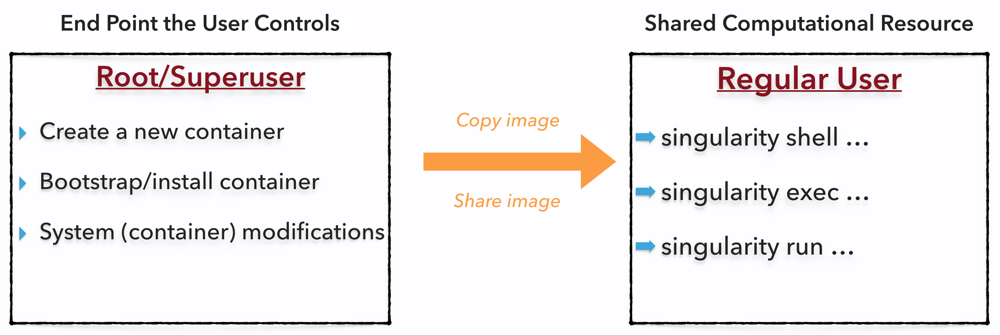

# Singularity User Guide
This document will cover the usage of Singularity, working with containers, and all of the user facing features. There is a separate "Singularity Administration Guide" which targets system administrators, so if you are a service provider, or an interested user, it is encouraged that you read that document as well.


## Welcome to Singularity!
Singularity is a container solution created by necessity for scientific and application driven workloads.

Over the past decade and a half, virtualization has gone from an engineering toy to a global infrastructure necessity and the evolution of enabling technologies has flourished. Most recently, we have seen the introduction of the latest spin on virtualization...  "containers". People's general conception of containers carry the heredity of it's lineage and thus has influenced it's features and use cases. This is both a good and a bad thing...

For the industry at the forefront of the virtualization front this is a good thing. The enterprise and web enabled cloud requirements are very much in alignment with the feature set of virtual machines, and thus the predeceasing container technologies, but this does not bode as well for the scientific world and specifically the high performance computation (HPC) use case. While there are many overlapping features of these two fields, they differ in ways that make a shared implementation generally incompatible. While some have been able to leverage custom built resources that can operate on a lower performance scale, a proper integration is difficult and perhaps impossible with today's technology.

Scientists are a resourceful bunch and many of the features which exist both purposefully and incidentally via commonly used container technologies are not only desired, they are required for scientific use cases. This is the necessity which drove the creation of Singularity and articulated it's 4 primary functions:

1. **Mobility Of Compute**

	Mobility of compute is defined as the ability to define, create and maintain a workflow and be confident that the workflow can be executed on different hosts, operating systems (as long as it is Linux) and service providers. Being able to contain the entire software stack, from data files to library stack, and portably move it from system to system is true mobility.

	Singularity achieves this by utilizing a distributable image format that contains the entire container and stack into a single file. This file can be copied, shared, archived, and thus standard UNIX file permissions also apply. Additionally containers are portable (even across different C library versions and implementations) which makes sharing and copying an image as easy as `cp` or `scp` or `ftp`.

2. **Reproducibility**

	As mentioned above, Singularity containers utilize a single file which is the complete representation of all the files within the container. The same features which facilitate mobility also facilitate reproducibility. Once a contained workflow has been defined, the container image can be snapshotted, archived, and locked down such that it can be used later and you can be confident that the code within the container has not changed. The container is not subject to any external influence from the host operating system (aside from the kernel).

3. **User Freedom**

	System integrators, administrators, and engineers spend a lot of effort maintaining the operating systems on the resources they are reasonable for, and as a result tend to take a cautious approach on their systems. As a result, you may see hosts installed with a production, mission critical operating system that is "old" and may not have a lot of packages available for it. Or you may see software or libraries that are too old or incompatible with the software you need to run, or maybe just haven't installed the software stack you need due to complexities with building, specific software knowledge, incompatibilities or conflicts with other installed programs.

	Singularity can give the user the freedom they need to install the applications, versions, and dependencies for their workflows without impacting the system in any way. Users can define their own working environment and literally copy that environment image (single file) to a shared resource, and run their workflow inside that image.

4. **Support On Existing Traditional HPC**

	There are a lot of container systems presently available which are designed either for the enterprise, a replacement for virtual machines, cloud focused, or requires kernel features which are either not stable yet, or not available on your distribution of choice (or both).

	Replicating a virtual machine cloud like environment within an existing HPC resource is not a reasonable task, but this is the direction one would need to take to integrate OpenStack or Docker into traditional HPC. The use cases do not overlap nicely, nor can the solutions be forcibly wed.

	The goal of Singularity is to support existing and traditional HPC resources as easily as installing a single package onto the host operating system. Some configuration maybe required via a single configuration file, but the defaults are tuned to be generally applicable for shared environments.

	Singularity can run on host Linux distributions from RHEL6 (RHEL5 for versions lower then 2.2) and similar vintages, and the contained images have been tested as far back as Linux 2.2 (approximately 14 years old). Singularity natively supports IniniBand, Lustre, and works seamlessly with all resource managers (e.g. SLURM, Torque, SGE, etc.) because it works like running any other command on the system.


## A High Level View of Singularity

### Security and privilege escalation
*A user inside a Singularity container is the same user as outside the container*

This is one of Singularities defining characteristics. It allows a user (that may already have shell access to a particular host) to simply run a command inside of a container image as themselves. Here is a scenario to help articulate this:

> %SERVER is a shared multi-tenant resource to a number of users and as a result it is a large expensive resource far exceeding the resources of my personal workstation. But because it is a shared system, no users have root access and it is a controlled environment managed by a staff of system administrators. To keep the system secure, only the system administrators are granted root access and they control the state of the operating system. If a user is able to escalate to root (even within a container) on %SERVER, they can do bad things to the network, cause denial of service to the host (as well as other hosts on the same network), and may have unrestricted access to file systems reachable by the container.

To mitigate security concerns like this, Singularity limits one's ability to escalate permission inside a container. For example, if I do not have root access on the target system, I should not be able to escalate my privileges within the container to root either. This is semi-antagonistic to Singularity's 3rd tenant; allowing the users to have freedom of their own environments. Because if a user has the freedom to create and manipulate their own container environment, surely they know how to escalate their privileges to root within that container. Possible means could be setting the root user's password, or enabling themselves to have sudo access. For these reasons, Singularity prevents user context escalation within the container, and thus makes it possible to run user supplied containers on shared infrastructures.

But this mitigation dictates the Singularity workflow. If user's need to be root in order to make changes to their containers, then they need to have an endpoint (a local workstation, laptop, or server) where they have root access. Considering almost everybody at least has a laptop, this is not an unreasonable or unmanageable mitigation, but it must be defined and articulated.


### The Singularity container image
Singularity makes use of a container image file, which physically contains the container. This file is a physical representation of the container environment itself. If you obtain an interactive shell within a Singularity container, you are literally running within that file.

This simplifies management of files to the element of least surprise, basic file permission. If you either own a container image, or have read access to that container image, you can start a shell inside that image. If you wish to disable or limit access to a shared image, you simply change the permission ACLs to that file.

There are numerous benefits for using a single file image for the entire container and is summarized here:

- Copying or branching an entire container is as simple as `cp`
- Permission/access to the container is managed via standard file system permissions
- Large scale performance (especially over parallel file systems) is very efficient
- No caching of the image contents to run (especially nice on clusters)
- Container is a sparse file so it only consumes the disk space actually used
- Changes are implemented in real time (image grows and shrinks as needed)
- Images can serve as stand-alone programs, and can be executed like any other program on the host

#### Other container formats supported
In addition to the default Singularity container image, the following other formats are supported:

- **directory**: Standard Unix directories containing a root container image
- **tar.gz**: Zlib compressed tar archives
- **tar.bz2**: Bzip2 compressed tar archives
- **tar**: Uncompressed tar archives
- **cpio.gz**: Zlib compressed CPIO archives
- **cpio**: Uncompressed CPIO archives

*note: the suffix for the formats (except directory) are necessary as that is how Singularity identifies the image type.*

#### Supported URIs
Singularity also supports several different mechanisms for obtaining the images using a standard URI format

- **http://** Singularity will use Curl to download the image locally, and then run from the local image
- **https://** Same as above using encryption
- **docker://** Singularity can pull Docker images from a Docker registry, and will run them non-persistently (e.g. changes are not persisted as they can not be saved upstream)


### Name-spaces and isolation
When asked, "What namespaces does Singularity virtualize?", the most appropriate response from a Singularity use case is "As few as possible!". This is because the goals of Singularity are mobility, reproducibility and freedom, not full isolation (as you would expect from industry driven container technologies). Singularity only separates the needed namespaces in order to satisfy our primary goals.

So considering that, and considering that the user inside the container is the same user outside the container, allows us to blur the lines between what is contained and what is on the host. When this is done properly, using Singularity feels more like running in a parallel universe, where there are two timelines. One timeline, is the one we are familiar with, where the system administrators installed their operating system of choice. But on this alternate timeline, we bribed the system administrators and they installed our favorite operating system, and gave us full control but configured the rest of the system identically. And Singularity gives us the power to pick between these two timelines.

Or in summary, Singularity allows us to virtually swap out the underlying operating system for one that we defined without affecting anything else on the system and still having all of the host resources available to us.

It can also be described as ssh'ing into another identical host running a different operating system. One moment you are on Centos-6 and the next minute you are on the latest version of Ubuntu that has Tensorflow installed, or Debian with the latest OpenFoam, or a custom workflow that you installed.

Additionally what name-spaces are selected for virtualization can be dynamic or conditional. For example, the PID namespace is not separated from the host by default, but if you want to separate it, you can with a command line (or environment variable) setting. You can also decide you want to contain a process so it can not reach out to the host file system if you don't know if you trust the image. But by default, you are allowed to interface with all of the resources, devices and network inside the container as you are outside the container.


### Compatibility with standard work-flows, pipes and IO
Singularity does its best to abstract the complications of running an application in a different environment then what is expected on the host. For example, applications or scripts within a Singularity container can easily be part of a pipeline that is being executed on the host. Singularity containers can also be executed from a batch script or other program (e.g. an HPC system's resource manager) naively.

Some usage examples of Singularity can be seen as follows:

```bash
$ singularity exec /tmp/Demo.img xterm
$ singularity exec /tmp/Demo.img python script.py
$ singularity exec /tmp/Demo.img python < /path/to/python/script.py
$ cat /path/to/python/script.py | singularity exec /tmp/Demo.img python
```

You can even run MPI executables within the container as simply as:

```bash
$ mpirun -np X singularity exec /path/to/container.img /usr/bin/mpi_program_inside_container (mpi program args)
```

### The Singularity Process Flow
When executing container commands, the Singularity process flow can be generalized as follows:

1. Singularity application is invoked
2. Global options are parsed and activated
3. The Singularity command (subcommand) process is activated
4. Subcommand options are parsed
5. The appropriate sanity checks are made
6. Environment variables are set
7. The Singularity Execution binary is called (`sexec`)
8. Sexec determines if it is running privileged and calls the `SUID` code if necessary
9. Namespaces are created depending on configuration and process requirements
10. The Singularity image is checked, parsed, and mounted in the `CLONE_NEWNS` namespace
11. Bind mount points are setup
12. The namespace `CLONE_FS` is used to virtualize a new root file system
13. Singularity calls `execvp()` and Singularity process itself is replaced by the process inside the container
14. When the process inside the container exists, all namespaces collapse with that process, leaving a clean system

All of the above steps take approximately 15-25 thousandths of a second to run, which is fast enough to seem instantaneous. 


## The Singularity Usage Workflow
The security model of Singularity (as described above, "*A user inside a Singularity container is the same user as outside the container*") defines the Singularity workflow. There are generally two classifications of actions you would implement on a container; modification (which encompasses creation, bootstrapping, installing, admin) and using the container.

Modification of containers (new or existing) generally require root administrative privileges just like these actions would require on any system, container, or virtual machine. This means that a user must have a system that they have root access on. This could be a server, workstation, or even a laptop. If you are using OS X or Windows on your laptop, it is recommended to setup Vagrant, and run Singularity from there (there are recipes for this which can be found at http://singularity.lbl.gov/). Once you have Singularity installed on your endpoint of choice, this is where you will do the bulk of your container development.

This workflow can be described visually as follows:



One the left side, you have your laptop, workstation, or a server that you control. Here you will create your containers, modify and update your containers as you need. Once you have the container with the necessary applications, libraries and data inside it can be easily shared to other hosts and executed without have root access. But if you need to make changes again to your container, you must go back to an endpoint or system that you have root on, make the necessary changes, and then re-upload the container to the computation resource you wish to execute it on.

## Quick Start Installation
If you already have Singularity installed, or if you are using Singularity from your distribution provider and the version they have included version 2.2 or newer, you may skip this section. Otherwise, it is recommended that you install or upgrade the version of Singularity you have on your system. The following commands will get you going, and install Singularity to `/usr/local`. If you have an earlier version of Singularity installed, you should first remove it before continuing with the following installation commands.

```bash
$ mkdir ~/git
$ cd ~/git
$ git clone https://github.com/singularityware/singularity.git
$ cd singularity
$ ./autogen.sh
$ ./configure --prefix=/usr/local --sysconfdir=/etc
$ make
$ sudo make install
```

You should note that the installation prefix is `/usr/local` but the configuration directory is `/etc`. This is done such that the configuration file is in the traditionally found location. If you omit that configure parameter, the configuration file will be found within `/usr/local/etc`.


## Overview of the Singularity Interface
Singularity is a command line driven interface that is designed to interact with containers and applications inside the container in as a transparent manner as possible. This means you can not only run programs inside a container as if they were on your host directly, but also redirect IO, pipes, arguments, files, shell redirects and sockets directly to the applications inside the container. 

Once you have Singularity installed, you should inspect the output of the `--help` option as follows:

```
$ singularity --help
USAGE: singularity [global options...] <command> [command options...] ...

GLOBAL OPTIONS:
    -d --debug    Print debugging information
    -h --help     Display usage summary
    -q --quiet    Only print errors
       --version  Show application version
    -v --verbose  Increase verbosity +1
    -x --sh-debug Print shell wrapper debugging information

GENERAL COMMANDS:
    help          Show additional help for a command

CONTAINER USAGE COMMANDS:
    exec          Execute a command within container
    run           Launch a runscript within container
    shell         Run a Bourne shell within container
    test          Execute any test code defined within container

CONTAINER MANAGEMENT COMMANDS (requires root):
    bootstrap     Bootstrap a new Singularity image from scratch
    copy          Copy files from your host into the container
    create        Create a new container image
    expand        Grow the container image
    export        Export the contents of a container via a tar pipe
    import        Import/add container contents via a tar pipe
    mount         Mount a Singularity container image

For any additional help or support visit the Singularity
website: http://singularity.lbl.gov/
```

Specifically notice the first line marked "USAGE". Here you will see the basic Singularity command usage, and notice the placement of the options. Option placement is very important in Singularity to ensure that the right options are being parsed at the right time. As you will see later in the guide, if you were to run a command inside the container called `foo -v`, then Singularity must be aware that the option `-v` that you are passing to the command `foo` is not intended to be parsed or interfered with by Singularity. So the placement of the options is very critical. In this example, you may pass the `-v` option twice, once in the Singularity global options and once for the command that you are executing inside the container. The final command may look like:

```bash
$ singularity -v exec container.img foo -v
```

The take home message here is that option placement is exceedingly important. The algorithm that Singularity uses for option parsing for both global options as well as subcommand options is as follows:

1. Read in the current option name
2. If the option is recognized do what is needed, move to next option (goto #1)
3. If the paramater is prefixed with a `-` (hyphen) but is not recognized, error out
4. If the next option is not prefixed with a `-` (hyphen), then assume we are done with option parsing

This means that options will continue to be parsed until no more options are listed.

*note: Options that require data (e.g. `--bind <path>`) must be separated by white space, not an equals sign!*

As the above "USAGE" describes, Singularity will parse the command as follows:

1. Singularity command (`singularity`)
2. Global options
3. Singularity subcommand (`shell` or `exec`)
4. Subcommand options
5. Any additional input is passed to the subcommand

You can get additional help on any of the Singularity subcommands by using any one of the following command syntaxes:

```bash
$ singularity help <subcommand>
$ singularity --help <subcommand>
$ singularity -h <subcommand>
$ singularity <subcommand> --help
$ singularity <subcommand -h
```

## Invoking a Non-Persistent Container
At this point, you can easily test Singularity by downloading and running a non-persistent container. As mentioned earlier, Singularity has the ability to interface with the main Docker Registry, so let's start off by pulling a container down from the main Docker Registry and launching a shell inside of a given container:

```bash
$ cat /etc/redhat-release 
CentOS Linux release 7.2.1511 (Core) 
$ singularity shell docker://ubuntu:latest
library/ubuntu:latest
Downloading layer: sha256:a3ed95caeb02ffe68cdd9fd84406680ae93d633cb16422d00e8a7c22955b46d4
Downloading layer: sha256:9f03ce1741bf604c84258a4c4f1dc98cc35aebdd76c14ed4ffeb6bc3584c1f9b
Downloading layer: sha256:61e032b8f2cb04e7a2d4efa83eb6837c6b92bd1553cbe46cffa76121091d8301
Downloading layer: sha256:50de990d7957c304603ac78d094f3acf634c1261a3a5a89229fa81d18cdb7945
Downloading layer: sha256:3a80a22fea63572c387efb1943e6095587f9ea8343af129934d4c81e593374a4
Downloading layer: sha256:cad964aed91d2ace084302c587dfc502b5869c5b1d15a1f0e458a45e3cadfaa6
Singularity: Invoking an interactive shell within container...

Singularity.ubuntu:latest> cat /etc/lsb-release
DISTRIB_ID=Ubuntu
DISTRIB_RELEASE=16.04
DISTRIB_CODENAME=xenial
DISTRIB_DESCRIPTION="Ubuntu 16.04.1 LTS"
Singularity.ubuntu:latest> which apt-get
/usr/bin/apt-get
Singularity.ubuntu:latest> exit
[gmk@centos7-x64 ~]$
```

In this example, you can see we started off on a Centos-7.2 host operating system, ran Singularity as a non-root user and used a URI which tells Singularity to pull a given container from the main Docker Registry and execute a shell within it. In this example, we are not telling Singularity to use a local image, which means that any changes we make will be non-persistent (e.g. the container is removed automatically as soon as the shell is exited).

You may select other images that are currently hosted on the main Docker Hub Library.

You now have a properly functioning Singularity installation on your system. 

## Creating a New Singularity Image
The primary use cases of Singularity revolve around the idea of mobility, portability, reproducibility, and archival of containers. These features are realized via Singularity via the Singularity image file. As explained earlier, Singularity images are single files which can be copied, shared, and easily archived along with relevant data. This means that the all of the computational components can be easily replicated, utilized and extended on by other researchers.

The first part of building your reproducible container is to first create the raw Singularity image file:

```bash
$ sudo singularity create /tmp/container.img
Creating a new image with a maximum size of 768MiB...
Executing image create helper
Formatting image with ext3 file system
Done.
```

Think of this as an empty bucket of a given size, and you can fill that bucket up to the specified size. By default the size in Singularity v2.2 is 768MiB (but this has changed from 512 - 1024 in different versions). You can override the default size by specifying the `--size` option in MiB as follows:

```bash
$ sudo singularity create --size 2048 /tmp/container.img
Creating a new image with a maximum size of 2048MiB...
Executing image create helper
Formatting image with ext3 file system
Done.
```

Notice that the permissions of the generated file. While the `umask` is adhered to, you should find that the file is executable. While at this point there is nothing to execute within that image, once this image has within it a proper container file system, you can define what this image will do when it is executed directly. 


## The Bootstrap Definition
The process of *bootstrapping* a Singularity container is equivalent to describing a recipe for the container creation. There are several recipe formats that Singularity supports, but only the primary format of version 2.2 will be documented here.

There are multiple sections of the Singularity bootstrap definition file:

1. **Header**: The Header describes the core operating system to bootstrap within the container. Here you will configure the base operating system features that you need within your container. Examples of this include, what distribution of Linux, what version, what packages must be part of a core install.
2. **Sections**: The reset of the definition is comprised of sections or blobs of data. Each section is defined by a `%` character followed by the name of the particular section. All sections are optional.

### The header fields:

#### Bootstrap:
The `Bootstrap: ` keyword identifies the Singularity module that will be used for building the core components of the operating system. There are several supported modules at the time of this writing:

1. **yum**: The YUM bootstrap module uses YUM on the host system to bootstrap the core operating system that exists within the container. This module is applicable for bootstrapping distributions like Red Hat, Centos, and Scientific Linux. When using the `yum` bootstrap module, several other keywords may also be necessary to define:

    - **MirrorURL**: This is the location where the packages will be downloaded from. When bootstrapping different RHEL/YUM compatible distributions of Linux, this will define which variant will be used (e.g. the only difference in bootstrapping Centos from Scientific Linux is this line.
    - **OSVersion**: When using the `yum` bootstrap module, this keyword is conditional and required only if you have specified a %{OSVERSION} variable name in the `MirrorURL` keyword. If the `MirrorURL` definition does not have the %{OSVERSION} variable, `OSVersion` can be omitted from the header field.
    - **Include**: By default the core operating system is an extremely minimal base, which may or may not include the means to even install additional packages. The `Include` keyword should define any additional packages which should be used and installed as part of the core operating system bootstrap. The best practice is to keep this keyword usage as minimal as possible such that you can then use the `%inside` scriptlet (explained shortly) to do additional installations. One common package you may want to include here is `yum` itself.

    Warning, there is a major limitation with using YUM to bootstrap a container and that is the RPM database that exists within the container will be created using the RPM library and Berkeley DB implementation that exists on the host system. If the RPM implementation inside the container is not compatible with the RPM database that was used to create the container, once the container has been created RPM and YUM commands inside the container may fail. This issue can be easily demonstrated by bootstrapping an older RHEL compatible image by a newer one (e.g. bootstrap a Centos 5 or 6 container from a Centos 7 host).

2. **debootstrap**: The Debian bootstrap module is a tool which is used specifically for bootstrapping distributions which utilize the `.deb` package format and `apt-get` repositories. This module will bootstrap any of the Debian and Ubuntu based distributions. When using the `debootstrap` module, the following keywords must also be defined:

    - **MirrorURL**: This is the location where the packages will be downloaded from. When bootstrapping different Debian based distributions of Linux, this will define which varient will be used (e.g. specifying a different URL can be the difference between Debian or Ubuntu).
    - **OSVersion**: This keyword must be defined as the alpha-character string associated with the version of the distribution you wish to use. For example, `trusty` or `stable`. 
    - **Include**: As with the `yum` module, the `Include` keyword will install additional packages into the core operating system and the best practice is to supply only the bare essentials such that the `%inside` scriptlet has what it needs to properly completely the bootstrap.

3. **arch**: The Arch Linux bootstrap module does not name any additional keywords at this time. By defining the `arch` module, you have essentially given all of the information necessary for that particular bootstrap module to build a core operating system.

4. **docker**: The Docker bootstrap module will create a core operating system image based on an image hosted on a particular Docker Registry server. By default it will use the primary Docker Library, but that can be overridden. When using the `docker` module, several other keywords may also be defined:

    - **From**: This keyword defines the string of the registry name used for this image in the format [name]:[version]. Several examples are: `ubuntu:latest`, `centos:6`, `alpine:latest`, or `debian` (if the version tag is ommitted, `:latest` is automatically used).
    - **IncludeCmd**: This keyword tells Singularity to utilize the Docker defined `Cmd` as the `%runscript` (defined below), if the `Cmd` is defined.
    - **Registry**: If the registry you wish to download the image from is not from the main Docker Library, you can define it here.
    - **Token**: Sometimes the Docker API (depending on version?) requires an authorization token which is generated on the fly. Toggle this with a `yes` or `no` here.


### Bootstrap sections:
Once the `Bootstrap` module has completed, the sections are identified and utilized if present. The following sections are supported in the bootstrap definition, and integrated during the bootstrap process in the following order:

#### %setup
This section blob is a Bourne shell scriptlet which will be executed on the host outside the container during bootstrap. The path to the container is accessible from within the running scriptlet environment via the variable `$SINGULARITY_ROOTFS`. For example, consider the following scriptlet:

```
%setup
    echo "Looking in directory '$SINGULARITY_ROOTFS' for /bin/sh"
    if [ ! -x "$SINGULARITY_ROOTFS/bin/sh" ]; then
        echo "Hrmm, this container does not have /bin/sh installed..."
        exit 1
    fi
    exit 0
```

As we investigate this example scriptlet, you will first see this is the `%outside` scriptlet as would be defined within our bootstrap. The following line simply echos a message and prints the variable `$SINGULARITY_ROOTFS` which is defined within the shell context that this scriptlet runs in. Then we check to see if `/bin/sh` is executable, and if it is not, we print an error message. Notice the `exit 1`. The exit value of the scriptlets communicates if the scriptlet ran successfully or not. As with any shell return value, an exit of 0 (zero) means success, and any other exit value is a failure.

*note: Any uncaught command errors that occur within the scriptlet will cause the entire build process to halt!*


#### %post
Similar to the `%setup` section, this section will be executed once during bootstrapping, but this scriptlet will be run from inside the container. This is where you should put additional installation commands, downloads, and configuration into your containers. Here is an example to consider:

```
%post
	echo "Installing Development Tools YUM group"
	yum -y groupinstall "Development Tools"
	echo "Installing OpenMPI into container..."
	mkdir /tmp/git
	cd /tmp/git
	git clone https://github.com/open-mpi/ompi.git
	cd ompi
	./autogen.pl
	./configure --prefix=/usr/local
	make
	make install
	/usr/local/bin/mpicc examples/ring_c.c -o /usr/bin/mpi_ring
	cd /
	rm -rf /tmp/git
	exit 0
```

The above example runs inside the container, so in this case we will first install the Centos YUM group development tools into the container, and then download Open MPI from the master branch from GitHub. We then build Open MPI and install it within the container. Next we compile one of the MPI test examples `ring_c.c` and install that to `/usr/bin/mpi_ring`. Finally we clean up and exit success.

*note: As with the `%setup` scriptlet, if any errors are encountered the entire process will fail.*

*another note: This is not a good example of a reproducible definition because it is pulling Open MPI from a moving target. A better example, would be to pull a static released version, but this serves as a good example of building a `%post` scriptlet.*


#### %runscript
The `%runscript` is another scriptlet, but it does not get executed during bootstrapping. Instead it gets persisted within the container to a file called `/singularity` which is the execution driver when the container image is ***run*** (either via the `singularity run` command or via executing the container directly).

When the `%runscript` is executed, all options are passed along to the executing script at runtime, this means that you can (and should) manage argument processing from within your runscript. Here is an example of how to do that:

```
%runscript
	echo "Arguments received: $*"
	exec /usr/bin/python "$@"
```

In this particular runscript, the arguments are printed as a single string (`$*`) and then they are passed to `/usr/bin/python` via a quoted array (`$@`) which ensures that all of the arguments are properly parsed by the executed command. The `exec` command causes the given command to replace the current entry in the process table with the one that is to be called. This makes it so the runscript shell process ceases to exist, and the only process running inside this container is the called Python command.

#### %test
You may choose to add a `%test` section to your definition file. This section will be run at the very end of the boostrapping process and will give you a chance to validate the container during the bootstrap process. You can also execute this scriptlet through the container itself, such that you can always test the validity of the container itself as you transport it to different hosts. Extending on the above Open MPI `%post`, consider this example:

```
%test
	/usr/local/bin/mpirun --allow-run-as-root /usr/bin/mpi_test

```

This is a simple Open MPI test to ensure that the MPI is build properly and communicates between processes as it should.

## Bootstrapping a Container
Bootstrapping is the process where we install an operating system and then configure it appropriately for a specified need. To do this we use a bootstrap definition file which is a recipe of how to specifically build the container and explained in detail in the previous section.

For the purpose of this example, we will use the portions of the bootstrap definition file above, and assemble it into a complete definition file:

```
# Bootstrap definition example for Centos-7 with the latest Open MPI from GitHub master

BootStrap: yum
OSVersion: 7
MirrorURL: http://mirror.centos.org/centos-%{OSVERSION}/%{OSVERSION}/os/$basearch/
Include: yum

%setup
    echo "Looking in directory '$SINGULARITY_ROOTFS' for /bin/sh"
    if [ ! -x "$SINGULARITY_ROOTFS/bin/sh" ]; then
        echo "Hrmm, this container does not have /bin/sh installed..."
        exit 1
    fi
    exit 0

%post
	echo "Installing Development Tools YUM group"
	yum -y groupinstall "Development Tools"
	echo "Installing OpenMPI into container..."
	mkdir /tmp/git
	cd /tmp/git
	git clone https://github.com/open-mpi/ompi.git
	cd ompi
	./autogen.pl
	./configure --prefix=/usr/local
	make
	make install
	/usr/local/bin/mpicc examples/ring_c.c -o /usr/bin/mpi_ring
	cd /
	rm -rf /tmp/git
	exit 0

%runscript
	echo "Arguments received: $*"
	exec /usr/bin/python "$@"

%test
	/usr/local/bin/mpirun --allow-run-as-root /usr/bin/mpi_ring

```

Taking this particular definition file as the example, we can use this to create our container.

The Singularity bootstrap command syntax is as follows:

```bash
$ singularity bootstrap
USAGE: singularity [...] bootstrap <container path> <definition file>
```

The `<container path>` is the path to the Singularity image file, and the `<definition file>` is the location of the definition file (the recipe) we will use to create this container. The process of building a container should always be done by root so that the correct file ownership and permissions are maintained. Also, so installation programs check to ensure they are the root user before proceeding. The bootstrap process may take anywhere from one minute to one hour depending on what needs to be done and how fast your network connection is.

Here are the steps necessary to create a container using the above definition file:

```bash
$ sudo singularity create --size 2048 /tmp/Centos7-ompi.img
Creating a new image with a maximum size of 2048MiB...
Executing image create helper
Formatting image with ext3 file system
Done.
$ sudo singularity bootstrap /tmp/Centos7-ompi.img centos7-ompi_master.def 
Bootstrap initialization
Checking bootstrap definition
Executing Prebootstrap module
Executing Bootstrap 'yum' module

...

+ /usr/local/bin/mpicc examples/ring_c.c -o /usr/bin/mpi_ring
+ cd /
+ rm -rf /tmp/git
+ exit 0
+ /usr/local/bin/mpirun --allow-run-as-root /usr/bin/mpi_ring
Process 0 sending 10 to 1, tag 201 (4 processes in ring)
Process 0 sent to 1
Process 0 decremented value: 9
Process 0 decremented value: 8
Process 0 decremented value: 7
Process 0 decremented value: 6
Process 0 decremented value: 5
Process 0 decremented value: 4
Process 0 decremented value: 3
Process 0 decremented value: 2
Process 0 decremented value: 1
Process 0 decremented value: 0
Process 0 exiting
Process 1 exiting
Process 2 exiting
Process 3 exiting
```

You can see from the output above, that the container has been built and the `%test` section has executed as expected. Our container has now been bootstrapped.


## Using Your Container Image
Singularity offers several primary user interfaces to containers: `shell`, `exec`, `run` and `test`. Using these interfaces, you can include any application or workflow that exists inside of a container as easy as if they were on the host system. These interfaces are designed specifically such that you do not need to be root or have escalated privileges to execute them. Additionally, Singularity is designed to abstract out the container system as elegantly as possibly such that the container does not exist. All IO, pipes, sockets, and native process control is handed through the container and to the calling application and Singularity elegantly gets completely out of the way for the process to run.

Generally the differences can be explained as follows

- **shell**: The `shell` interface (or Singularity subcommand) will invoke an interactive shell within the container. By default the shell called is `/bin/sh`, but this can be overridden with the shell option `--shell /path/to/shell` or via the environment variable `SINGULARITY_SHELL`. Once the shell is exited, the namespaces all collapse, and all mounts, binds, and contained processes exit.
- **exec**: As the name implies, the `exec` interface/subcommand offers the ability to execute a single command within a container environment. This is a simple way to run programs, scripts and workflows that exist within a container from the host system. You can run this command from within a script on the host system or from a batch scheduler or an `mpirun` command.
- **run**: Running a container will execute a predefined script (defined in the Singularity bootstrap definition as `%runscript`). If not run script has been provided, the container will launch a shell instead.
- **test**: If you specified a `%test` section within the Singularity bootstrap definition, you can run that test as yourself. This is a useful way to ensure that a container works properly not only when built, but when transferred to other hosts or infrastructures.


### Bind Paths
Singularity 'swaps' out the currently running root operating system on the host for what is inside the container, and in doing so none of the host file systems are accessible anymore. As a workaround for this, Singularity will *bind* those paths back in via two primary methods: system defined bind points and conditional user defined bind points.

To *mount* a bind path inside the container, a ***bind point*** must be defined within the container. The bind point is a target location entity to which the actual directory or file can be bound to. This means that if you want to bind to a point within the container such as `/global`, that directory must already exist within the container.

It is however possible that the system administrator has enabled a Singularity feature called *overlay* in the `/etc/singularity/singularity.conf` file. This will cause the bind points to be created on an as needed basis in an overlay file system so that the underlying container is not modified. But because the *overlay* feature is not always used, it maybe necessary for container standards to exist to ensure portability from host to host.

If a bind path is requested, and the bind point does not exist within the container, a warning message will be displayed, and Singularity will continue trying to mount file system. For example:

```bash
$ singularity shell /tmp/Centos7-ompi.img 
WARNING: Non existant bind point (directory) in container: '/global'
Singularity: Invoking an interactive shell within container...

Singularity.Centos7-ompi.img> 
```

Even though `/global` did not exist inside the container, the shell command printed a warning but continued on. If we enable `enable overlay = yes` in the `/etc/singularity/singularity.conf` you will find that we no longer get the error and `/global` is created and accessible as expected:

```bash
$ singularity shell /tmp/Centos7-ompi.img 
Singularity: Invoking an interactive shell within container...

Singularity.Centos7-ompi.img> 
```

#### System defined bind points
The system administrator has the ability to define what bind points will be included automatically inside each container. The bind paths are locations on the host's root file system which should also be visible within the container. Some of the bind paths are automatically derived (e.g. a user's home directory) and some are statically defined (e.g. `bind path = ` in `/etc/singularity/singularity.conf`).


#### User defined bind points
If the system administrator has enabled user control of binds (via `user bind control = yes` in `/etc/singularity/singularity.conf`), you will be able to request your own bind points within your container processes. The most typical example of this is the `--bind` option and here is an example binding `/tmp` to `/scratch` (which again does not exist within the container):

```bash
$ singularity shell -B /tmp:/scratch /tmp/Centos7-ompi.img 
WARNING: Skipping user bind, non existant bind point (directory) in container: '/scratch'
Singularity: Invoking an interactive shell within container...

Singularity.Centos7-ompi.img> 
```


### Examples
Here are some examples using the container we created earlier on how to use the Singularity container interface commands as a normal user:

#### Shell
```bash
$ echo world > hello
$ singularity shell /tmp/Centos7-ompi.img 
Singularity: Invoking an interactive shell within container...

Singularity.Centos7-ompi.img> pwd
/home/gmk/demo
Singularity.Centos7-ompi.img> ls
hello
Singularity.Centos7-ompi.img> cat hello 
world
Singularity.Centos7-ompi.img> exit
```
You can see from the above example, we were able to have access to our current working directory. That is because one of the default bind paths that is included and enabled by default in Singularity is the binding of the user's home directory. In this example, you can see that we created a file called `hello` in the current directory and after we entered the Singularity container we landed in the same directory and thus `hello` is accessible to us here as we would expect.


#### Exec
Starting with the file `hello.py` in the current directory with the contents of:

```python
#!/usr/bin/python

import sys
print("Hello World: The Python version is %s.%s.%s" % sys.version_info[:3])
```

Because our home directory is automatically bound into the container, and we are running this from our home directory, we can easily execute that script using the Python within the container:

```bash
$ singularity exec /tmp/Centos7-ompi.img /usr/bin/python hello.py 
Hello World: The Python version is 2.7.5
```

We can also pipe that script through the container and into the Python binary which exists inside the container using the following command:

```bash
$ cat hello.py | singularity exec /tmp/Centos7-ompi.img /usr/bin/python 
Hello World: The Python version is 2.7.5
```

For demonstration purposes, let's also try to use the latest Python container which exists in DockerHub to run this script:

```bash
$ singularity exec docker://python:latest /usr/local/bin/python hello.py
library/python:latest
Downloading layer: sha256:a3ed95caeb02ffe68cdd9fd84406680ae93d633cb16422d00e8a7c22955b46d4
Downloading layer: sha256:fbd06356349dd9fb6af91f98c398c0c5d05730a9996bbf88ff2f2067d59c70c4
Downloading layer: sha256:644eaeceac9ff6195008c1e20dd693346c35b0b65b9a90b3bcba18ea4bcef071
Downloading layer: sha256:a3ed95caeb02ffe68cdd9fd84406680ae93d633cb16422d00e8a7c22955b46d4
Downloading layer: sha256:a3ed95caeb02ffe68cdd9fd84406680ae93d633cb16422d00e8a7c22955b46d4
Downloading layer: sha256:a3ed95caeb02ffe68cdd9fd84406680ae93d633cb16422d00e8a7c22955b46d4
Downloading layer: sha256:766692404ca72f4e31e248eb82f8eca6b2fcc15b22930ec50e3804cc3efe0aba
Downloading layer: sha256:a3ed95caeb02ffe68cdd9fd84406680ae93d633cb16422d00e8a7c22955b46d4
Downloading layer: sha256:a3ed95caeb02ffe68cdd9fd84406680ae93d633cb16422d00e8a7c22955b46d4
Downloading layer: sha256:6a3d69edbe90ef916e1ecd8d197f056de873ed08bcfd55a1cd0b43588f3dbb9a
Downloading layer: sha256:ff18e19c2db42055e6f34323700737bde3c819b413997cddace2c1b7180d7efd
Downloading layer: sha256:7b9457ec39de00bc70af1c9631b9ae6ede5a3ab715e6492c0a2641868ec1deda
Downloading layer: sha256:a3ed95caeb02ffe68cdd9fd84406680ae93d633cb16422d00e8a7c22955b46d4
Downloading layer: sha256:6a5a5368e0c2d3e5909184fa28ddfd56072e7ff3ee9a945876f7eee5896ef5bb
Hello World: The Python version is 3.5.2
```

#### Run
As we have defined within the `%runscript` above, we can execute a script, workflow, or a given command using the `run` Singularity container interface command. In the above examples, we specified the run script to `exec /usr/bin/python "%@"` which will call Python and pass along any arguments we have supply.

For example:

```bash
$ singularity run /tmp/Centos7-ompi.img --version
Python 2.7.5
$ singularity run /tmp/Centos7-ompi.img hello.py 
Hello World: The Python version is 2.7.5
$ singularity run /tmp/Centos7-ompi.img 
Python 2.7.5 (default, Nov 20 2015, 02:00:19) 
[GCC 4.8.5 20150623 (Red Hat 4.8.5-4)] on linux2
Type "help", "copyright", "credits" or "license" for more information.
>>> 
```

#### Executing a container directly
Additionally, the `run` interface gets called when the container file is executed directly (yes, the container is set as executable!):

```bash
$ ls -l /tmp/Centos7-ompi.img 
-rwxr-xr-x. 1 root root 2147483679 Oct  9 05:31 /tmp/Centos7-ompi.img
$ /tmp/Centos7-ompi.img hello.py 
Hello World: The Python version is 2.7.5
```

This means you could even rename this container to something related to the runscript (perhaps "*centos7-python.exe*") and have users call that directly instead of the system python program.

## Making Changes to an Existing Container
It is possible that you may need to make changes to a container after it has been bootstrapped. For that, let's repeat the Singularity mantra "*A user inside a Singularity container is the same user as outside the container*". This means if you want to make changes to your container, you must be root inside your container, which means you must first become root outside your container. Additionally you will need to tell Singularity that you wish to mount the container as `--writable` so you can change the contents. Let's examine the following example:

```bash
$ singularity shell /tmp/Centos7-ompi.img 
Singularity: Invoking an interactive shell within container...

Singularity.Centos7-ompi.img> which ls
sh: which: command not found
```

Let's use this opportunity to install an additional package into this container:

```bash
$ sudo singularity exec --writable /tmp/Centos7-ompi.img yum install which
Loaded plugins: fastestmirror
Loading mirror speeds from cached hostfile
 * base: mirror.hostduplex.com
 * extras: mirrors.centos.webair.com
 * updates: linux.mirrors.es.net
Resolving Dependencies
--> Running transaction check
---> Package which.x86_64 0:2.20-7.el7 will be installed
--> Finished Dependency Resolution

Dependencies Resolved

====================================================================================================
 Package               Arch                   Version                    Repository            Size
====================================================================================================
Installing:
 which                 x86_64                 2.20-7.el7                 base                  41 k

Transaction Summary
====================================================================================================
Install  1 Package

Total download size: 41 k
Installed size: 75 k
Is this ok [y/d/N]: y
Downloading packages:
which-2.20-7.el7.x86_64.rpm                                                  |  41 kB  00:00:00     
Running transaction check
Running transaction test
Transaction test succeeded
Running transaction
  Installing : which-2.20-7.el7.x86_64                                                          1/1 
  Verifying  : which-2.20-7.el7.x86_64                                                          1/1 

Installed:
  which.x86_64 0:2.20-7.el7                                                                         

Complete!
```

We could have also used the `shell` container interface command to do this.

```bash
$ sudo singularity shell --writable /tmp/Centos7-ompi.img
Singularity: Invoking an interactive shell within container...

Singularity.Centos7-ompi.img> yum install vi
Loaded plugins: fastestmirror
Loading mirror speeds from cached hostfile
 * base: mirror.hostduplex.com
 * extras: mirrors.centos.webair.com
 * updates: linux.mirrors.es.net
Resolving Dependencies
--> Running transaction check
---> Package vim-minimal.x86_64 2:7.4.160-1.el7 will be installed
--> Finished Dependency Resolution

Dependencies Resolved

====================================================================================================
 Package                  Arch                Version                       Repository         Size
====================================================================================================
Installing:
 vim-minimal              x86_64              2:7.4.160-1.el7               base              436 k

Transaction Summary
====================================================================================================
Install  1 Package

Total download size: 436 k
Installed size: 896 k
Is this ok [y/d/N]: y
Downloading packages:
vim-minimal-7.4.160-1.el7.x86_64.rpm                                         | 436 kB  00:00:00     
Running transaction check
Running transaction test
Transaction test succeeded
Running transaction
  Installing : 2:vim-minimal-7.4.160-1.el7.x86_64                                               1/1 
  Verifying  : 2:vim-minimal-7.4.160-1.el7.x86_64                                               1/1 

Installed:
  vim-minimal.x86_64 2:7.4.160-1.el7                                                                

Complete!
Singularity.Centos7-ompi.img> exit
```

## Best Practices for Bootstrapping
When bootstrapping a container, it is best to consider the following:

1. Install packages, programs, data, and files into operating system locations (e.g. not `/home`, `/tmp`, or any other directories that might get commonly binded on).
2. If you require any special environment variables to be defined, add them the `/environment` file inside the container.
3. Files should never be owned by actual users, they should always be owned by a system account (UID < 500).
4. Ensure that the container's `/etc/passwd`, `/etc/group`, `/etc/shadow`, and no other sensitive files have anything but the bare essentials within them.
5. Do all of your bootstrapping via a definition file instead of manipulating the containers by hand (with the `--writable` options), this ensures greatest possibility of reproducibility and mitigates the *black box effect*.


## Getting Additional Help, Support, Information

As always, goto http://singularity.lbl.gov for the latest information, documentation, support, and news.

If you think you have found a bug, or want to request a new feature, submit a bug report at: https://github.com/singularityware/singularity/issues/new

## Want to Join the Team?!
We want you! Your help! Your contributions! Your presence! Come and hop on our Slack channel by requesting an invite from gmkurtzer@lbl.gov!


